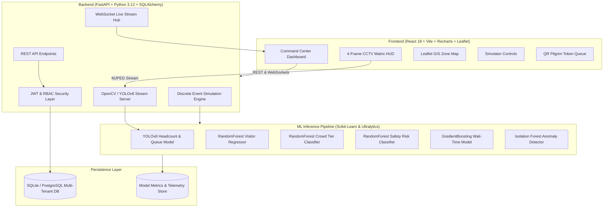

# DARSHANAI – AI-Powered Multi-Temple Crowd Intelligence & Devotee Safety Management System

<div align="center">

[](https://fastapi.tiangolo.com/)
[](https://react.dev/)
[](https://ultralytics.com/)
[](https://scikit-learn.org/)
[](https://vitejs.dev/)
[](https://www.docker.com/)
[](https://github.com/ssmahadevcse2025/DarshanAI)

**Predict. Prevent. Protect.**  
*Real-time pilgrim crowd dynamics, AI computer vision surveillance, multi-tenant temple operations, and intelligent safety orchestration.*

[Explore Architecture](#-system-architecture) • [Live CCTV Matrix](#-live-4-frame-cctv--ai-vision-matrix) • [ML Performance](#-machine-learning-evaluation-summary) • [Quickstart](#-quickstart-guide) • [Demo Walkthrough](#-complete-interactive-demonstration-walkthrough)

</div>

---

<details>
<summary><b>🔄 Team Collaboration & Git Auto-Sync (Antigravity & Teammates) — [Click to Expand]</b></summary>

<br/>

Whenever starting a work session or collaborating with team members on **Google Antigravity**:

```bash
# Option 1: 1-Click Windows Batch Script (Double-click in Explorer or run in terminal)
.\pull_latest.bat

# Option 2: PowerShell script with colored telemetry
.\pull_latest.ps1

# Option 3: npm script from repository root
npm run pull

# Option 4: Linux / macOS / Git Bash
./pull_latest.sh
```

> **Antigravity Automation:** Workspace configuration in [`AGENTS.md`](./AGENTS.md) and [`.agents/rules/team_sync.md`](./.agents/rules/team_sync.md) instructs the Antigravity Agent to automatically check and pull remote updates on session start before writing code.

</details>

---

## 🌟 Core System Highlights

| Feature Area | Implementation Details |
|---|---|
| **Real-Time Computer Vision** | Integrated **YOLOv8 + OpenCV** stream pipeline with corner HUD brackets, dynamic bounding centroids, real devotee queue counters, and live FPS telemetry. |
| **Multi-Channel CCTV Matrix** | 4-frame video wall featuring sensor telemetry, centroid density heatmap, YouTube live temple matrix (Somnath, Tirupati, Varanasi, Madurai), and real-time offline AI video stream inference. |
| **5-Model ML Predictive Engine** | Production ensemble: Random Forest Regressor (crowd volume), Random Forest Classifier (density tiers), Safety Risk Classifier, Gradient Boosting (queue wait times), and Isolation Forest (uncontrolled surge anomalies). |
| **Multi-Tenant Data Isolation** | Cryptographic tenant separation (`TEMPLE-001`, `TEMPLE-002`, `TEMPLE-003`). All API queries, DB sessions, and WebSocket connections enforce strict JWT tenant validation. |
| **Digital Pilgrim Token & QR Flow** | Token generator with dynamic verification, QR scanner simulation, queue status notifications, and bottleneck mitigation. |
| **GIS Congestion Heatmap** | Interactive Leaflet GIS map visualizing physical temple zones (*Garbhagriha, Queue Complex, Outer Courtyard, Prasadam Counters*) with live color transitions based on ML risk levels. |
| **Full Operations Simulator** | Configurable time-dilation engine (1x to 60x clock speed) with presets: *Normal Day, Festival Rush, VIP Visit, Heavy Rain, Gate Failure, and Emergency Evacuation*. |

---

## 🏗️ System Architecture



---

## 📹 Live 4-Frame CCTV & AI Vision Matrix

The **Crowd Monitoring** command center displays a synchronised quad-panel surveillance matrix:

```
+------------------------------------+------------------------------------+
|  FRAME 1: Raw Sensor Stream        |  FRAME 2: AI Centroid & Heatmap    |
|  - Real-time video sensor feed     |  - Centroid density tracking HUD   |
|  - Resolution: 1080p @ 30 FPS      |  - Crowd density overlay & alert   |
+------------------------------------+------------------------------------+
|  FRAME 3: Live Devotee Matrix      |  FRAME 4: YOLOv8 Devotee Counter   |
|  - Multi-Channel Temple Switcher   |  - Real-time YOLOv8 + OpenCV       |
|  - Somnath / Tirupati / Varanasi   |  - Devotee Queue & Headcount HUD   |
+------------------------------------+------------------------------------+
```

### Channel Switcher Matrix (Frame 3)
- **CH 1: Sri Somnath Temple** — Main Entrance & Oceanfront Courtyard
- **CH 2: Sri Venkateswara (Tirupati)** — Queue Complex & Vaikuntam Enclosures
- **CH 3: Kashi Vishwanath (Varanasi)** — Ganga Ghat & Corridor Gate
- **CH 4: Meenakshi Amman (Madurai)** — Gopuram Entry & Sacred Tank

### YOLOv8 Devotee Queue Counter (Frame 4)
- Automated devotee detection with bounding boxes and corner bracket reticles.
- High-efficiency local inference on bundled high-density devotee crowd video clips.
- Dynamic queue throughput metrics, wait time prediction, and instantaneous risk rating.

---

## 📊 Machine Learning Evaluation Summary

Trained on **8,760 hourly records** (1 full simulated year) encompassing diurnal rush patterns, auspicious festivals (Shivaratri, Diwali, Navratri), monsoons, and sudden gate failures:

| Model | Target Variable | Algorithm | Key Metric | Metric Value |
|---|---|---|---|---|
| **Crowd Regressor** | `visitor_count` | `RandomForestRegressor` | **R² Score / MAE** | **0.9891** / 82.01 visitors |
| **Crowd Classifier** | `crowd_level` (LOW, MODERATE, HIGH, CRITICAL) | `RandomForestClassifier` | **Accuracy / F1** | **97.55%** / 0.9754 |
| **Risk Classifier** | `risk_level` (LOW, MEDIUM, HIGH, CRITICAL) | `RandomForestClassifier` | **Accuracy / F1** | **98.00%** / 0.9800 |
| **Waiting Time Model** | `waiting_time` (minutes) | `GradientBoostingRegressor` | **R² Score / MAE** | **0.9865** / 3.31 mins |
| **Anomaly Detector** | Stampede Risk / Flow Blockages | `IsolationForest` | **Contamination** | **0.03 (Trained & Active)** |

<details>
<summary><b>📈 Feature Importance & Weight Analysis — [Click to Expand]</b></summary>

<br/>

The top predictive features driving the machine learning inference models:
1. **`hour_of_day` (38.4%)**: Strong diurnal curves corresponding to Morning Aarti (06:00–08:00) and Evening Darshan (18:00–20:30).
2. **`is_festival` (24.1%)**: Multiplier surges up to 4.2x during major pilgrimage calendars.
3. **`gate_status` (14.6%)**: Gate closure or security check delays directly causing upstream queue bottlenecks.
4. **`weather_condition` (12.3%)**: Monsoon rainfall concentrating crowds under covered sanctum queue shelters.
5. **`is_weekend` (10.6%)**: Sustained elevated traffic patterns on Saturdays and Sundays.

</details>

---

## 🚀 Quickstart Guide

### Prerequisites
- **Python 3.10+** (Tested on Python 3.12)
- **Node.js 18+** & **npm**
- **Git**

### Step 1: Environment Setup & Python Dependencies
```bash
# Clone the repository
git clone https://github.com/ssmahadevcse2025/DarshanAI.git
cd DarshanAI

# Install Python backend dependencies
pip install -r requirements.txt
```

### Step 2: Dataset Generation & Model Training
```bash
# Generate 1-year historical dataset (8,760 hourly records)
python ml/generate_dataset.py

# Train and benchmark all 5 ML models
python -m ml.train_models
```

### Step 3: Launch FastAPI Backend
```bash
# Start backend server on port 8000
python -m uvicorn backend.main:app --reload --port 8000
```
> Interactive Swagger API Docs: **`http://localhost:8000/docs`**

### Step 4: Launch React Command Center
```bash
cd frontend

# Install Node dependencies
npm install

# Start Vite dev server
npm run dev
```
> Access Dashboard at: **`http://localhost:5173`**

---

## 🔑 Demonstration Accounts & RBAC Matrix

| Role | Tenant Scope | Email | Password | Access Rights |
|---|---|---|---|---|
| **Super Admin** | Global Platform | `superadmin@darshanai.com` | `SuperAdmin123!` | All temples, system config, global analytics |
| **Temple Admin** | Sri Somnath (`TEMPLE-001`) | `admin@temple001.com` | `TempleAdmin123!` | Somnath management, staff, simulator, CCTV |
| **Operations Manager**| Sri Somnath (`TEMPLE-001`) | `manager@temple001.com` | `Manager123!` | Queue rules, token flow, zone assignments |
| **Security Officer** | Sri Somnath (`TEMPLE-001`) | `security@temple001.com` | `Security123!` | CCTV matrix, evacuation protocols, alerts |
| **Medical Lead** | Sri Somnath (`TEMPLE-001`) | `medical@temple001.com` | `Medical123!` | Incident reports, medical dispatch, heat zones |
| **Receptionist** | Sri Somnath (`TEMPLE-001`) | `reception@temple001.com` | `Reception123!` | Token issuance, devotee check-in verification |
| **Volunteer Lead** | Sri Somnath (`TEMPLE-001`) | `volunteer@temple001.com` | `Volunteer123!` | Zone queue assistance, advisory feeds |
| **Temple Admin (Tirupati)** | Sri Venkateswara (`TEMPLE-002`)| `admin@temple002.com`| `TempleAdmin123!`| Isolated Tirupati tenant environment |

---

## 🔁 Complete Interactive Demonstration Walkthrough

Follow these steps to demonstrate the full capabilities of DarshanAI:

```
[Login Screen] ──> [Executive Dashboard] ──> [Simulation Engine] ──> [Live CCTV Matrix] ──> [GIS Map] ──> [Tenant Switch]
```

1. **Authentication**: Open `http://localhost:5173/login` and click the quick-autofill for **Temple Admin (`TEMPLE-001`)**.
2. **Dashboard Overview**:
   - Inspect live KPI cards: Current Headcount, Predicted Headcount (+1h), Density Level, Risk Index, and Average Wait Time.
   - Review the **AI Action Recommendation Feed** (e.g., *"Open Gate 3 & Divert Courtyard Overflow"*).
3. **Trigger Crowd Simulation**:
   - Navigate to **Simulation** in the sidebar.
   - Set speed multiplier to **30x** and select scenario **"Festival Rush"** or **"Gate Malfunction"**.
   - Watch the visitor count surge in real-time. Notice the Risk Index change to **CRITICAL** and the Anomaly Detector trigger.
4. **Live Surveillance Video Wall**:
   - Open **Crowd Monitoring**.
   - Observe **Frame 1** (Raw Sensor) and **Frame 2** (AI Density Centroid Overlay).
   - Test **Frame 3** by switching live devotee channels (Somnath, Tirupati, Varanasi, Madurai).
   - Watch **Frame 4** run live YOLOv8 devotee detection with realtime bounding boxes and queue velocity tracking.
5. **GIS Zone Congestion Map**:
   - Open **Temple Map**. Observe how zones (Sanctum, Queue Complex, Courtyard) dynamically transition from Green -> Yellow -> Orange -> Red based on simulated congestion.
6. **Token Issuance & QR Verification**:
   - Open **Pilgrim Tokens**. Issue a virtual token, copy the token ID, and verify it via the scanner interface.
7. **Tenant Isolation Verification**:
   - Log out, then log in as **Tirupati Temple Admin (`admin@temple002.com`)**.
   - Verify that Tirupati has distinct data, different zone metrics, and completely independent historical streams.

---

<details>
<summary><b>📡 REST API & WebSocket Endpoints Reference — [Click to Expand]</b></summary>

<br/>

| Endpoint | Method | Description | Auth Required |
|---|---|---|---|
| `/api/auth/login` | `POST` | Authenticate staff member and receive JWT token | No |
| `/api/auth/me` | `GET` | Retrieve current authenticated user profile and permissions | Yes |
| `/api/simulation/state` | `GET` | Get current simulation state and active scenario | Yes |
| `/api/simulation/start` | `POST` | Start simulation clock with optional speed multiplier | Yes |
| `/api/simulation/scenario` | `POST` | Inject preset scenario (*Festival Rush, Surge, Rain*) | Yes |
| `/api/cctv/stream/yolo` | `GET` | MJPEG live stream of YOLOv8 queue counter inference | Yes |
| `/api/cctv/analytics` | `GET` | Real-time queue count, velocity, and detection FPS | Yes |
| `/api/cctv/select_channel`| `POST` | Dynamically change active inference feed source | Yes |
| `/api/tokens/issue` | `POST` | Generate new pilgrim token with encrypted QR payload | Yes |
| `/api/tokens/verify` | `POST` | Scan and validate pilgrim queue token at security gate | Yes |
| `/ws/live-stream` | `WebSocket` | High-frequency telemetry and predictive ML WebSocket stream | Yes |

</details>

---

<details>
<summary><b>🐳 Docker & Cloud Deployment Guide — [Click to Expand]</b></summary>

<br/>

### Docker Compose
Run the entire platform with one command:
```bash
docker-compose up --build
```
- Frontend: `http://localhost:80`
- Backend: `http://localhost:8000`

### Production Cloud Deployment
- **Frontend (Vercel)**: Pre-configured via `vercel.json` with zero-config SPA rewrite routing.
- **Backend (Render / Railway / Fly.io)**: Pre-configured via `render.yaml` and `Dockerfile.backend`.

</details>

---

## 👥 Contributors

Developed with passion for pilgrim safety, smart governance, and intelligent computer vision:

- **K. Aadhavan** — [@adhavanmasscoc-maker](https://github.com/adhavanmasscoc-maker)
- **Shenbagamahadevan** — [@ssmahadevcse2025](https://github.com/ssmahadevcse2025)

**Repository**: [github.com/ssmahadevcse2025/DarshanAI](https://github.com/ssmahadevcse2025/DarshanAI)

---

<div align="center">
<b>DarshanAI</b> — Ensuring every devotee's journey is safe, peaceful, and blessed.
</div>
